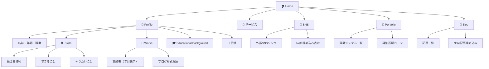

# サイトマップ（Site Map）

## 概要
このサイトマップは「Neo‑Typographic Fusion Portfolio」のページ構成とリンク構造を定義します。レスポンシブ対応（PC時はHeader Nav、モバイル時はSidebar Nav）を前提としています。

## サイト構造ツリー

## ページ別詳細構成

### 🏠 Home
**役割**: 全ページへのランディングハブ  
**ナビゲーション**: 各主要セクションへのカード型リンク

### 👤 Profile
**役割**: 個人情報・スキル・実績の包括表示  
**子セクション**:
- **基本情報**: 名前、年齢、職業、趣味（クリック型詳細表示）
- **Skills**: 技術アイコン一覧、できること・やりたいこと
- **Works**: 年月実績表 + ブログ形式並行表示
- **Educational Background**: 学歴年表
- **思想**: ブロック形式テキスト

### 🔧 サービス
**役割**: 提供サービス一覧  
**内容**: サービス項目の説明・料金・問い合わせ導線

### 📱 SNS
**役割**: 外部SNS連携ハブ  
**外部リンク**: note, X, Instagram, Facebook, LinkedIn, Qiita, Zenn  
**表示形式**: 新しいタブで開く + note埋め込み表示

### 💼 Portfolio
**役割**: 開発実績ショーケース  
**レイアウト**: タイトル → 画像 → 簡単説明 → 詳細説明リンク  
**機能**: クリックで実際のサイトに遷移

### 📝 Blog
**役割**: 記事・知見の発信基地  
**コンテンツ**: 自作記事一覧 + note記事埋め込み並行表示

## レスポンシブナビゲーション設計

### PC画面（横長）
- **Header Nav**: 上部固定、水平メニュー
- **レイアウト**: `Home | Profile | サービス | SNS | Portfolio | Blog`

### モバイル画面（縦長）
- **Sidebar Nav**: ハンバーガーメニュー（≡）
- **ドロワー**: 左からスライドイン、オーバーレイ背景

## 共通フッター
全ページ下部に表示:
- **ページリンク集**: 全主要ページへのテキストリンク
- **コピーライト**: `© 2025 KawasakiK`

## URL構造

| ページ | パス | 説明 |
|--------|------|------|
| Home | `/` | トップページ |
| Profile | `/profile` | プロフィール総合 |
| サービス | `/services` | サービス一覧 |
| SNS | `/sns` | SNS連携ページ |
| Portfolio | `/portfolio` | 作品集 |
| Blog | `/blog` | ブログ記事一覧 |
| 記事詳細 | `/blog/[slug]` | 個別記事ページ |
| 作品詳細 | `/portfolio/[id]` | 作品詳細説明 |

## アクセシビリティ考慮事項
- **キーボードナビゲーション**: Tab順序の論理的設計
- **スクリーンリーダー**: aria-label適切設定
- **カラーコントラスト**: WCAG 2.1 AA準拠（背景#0F0F0F、文字#F9F9F9）
- **フォーカス表示**: アクセント色（red/blue/yellow）でのフォーカスリング 